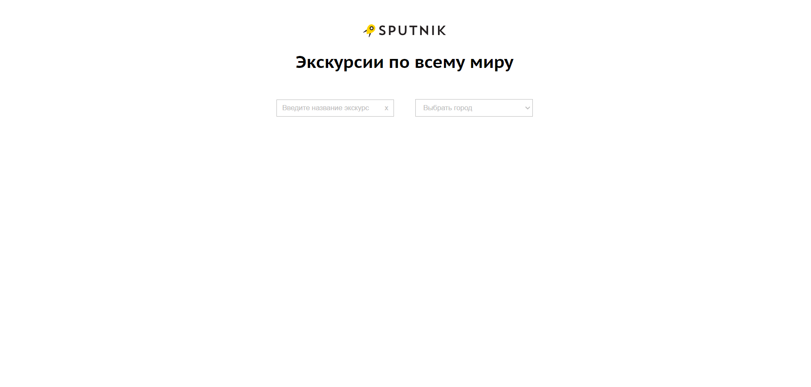
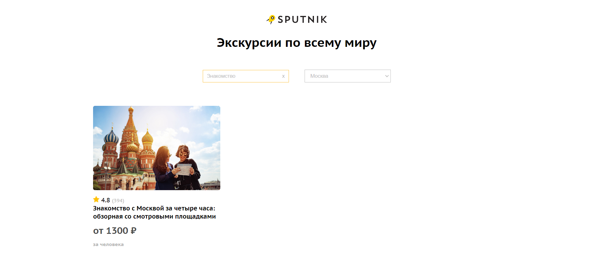
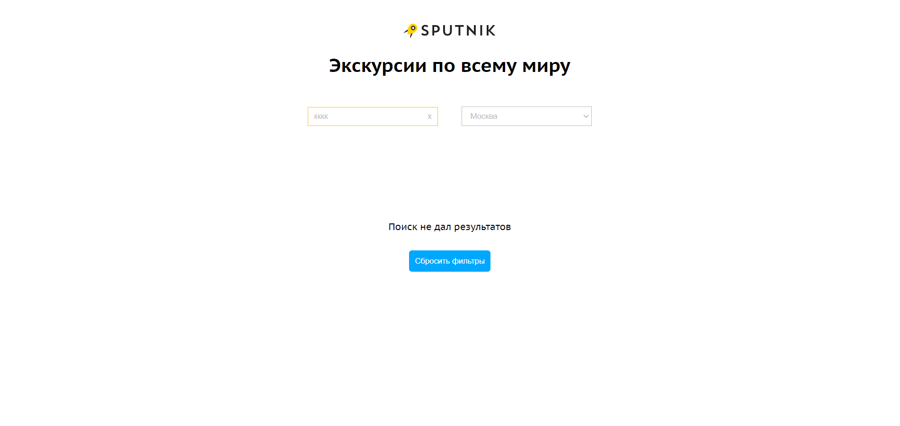

  
   

          <a align="center" href="https://sputnik8-opal.vercel.app/">посмотреть демо</a>
        
  

# 

# 🔎Введение
Если у вас (как и у меня) возникает ошибка с CORS: Access-Control-Allow-Origin, то включите расширение Allow CORS: Access-Control-Allow-Origin в браузере  
.   
.   
.   
<i>p.s.</i> для решения этой проблемы сперва были созданы прокси сервера, но они работали только при локальном запуске и не подходили для развертывания приложения в облаке. 
Поэтому в качестве оптимального решения было выбрано установить расширение в браузере. 

# ✨О проекте
Данное приложение реализует поиск экскурсий по названиям и городу. Оно позволяет:
- Ввести название экскурсии и/или выбрать город
- Сбросить название экскурсии, нажав на крестик в поле ввода
- Сбросить фильтры по кнопке, если поиск не даст результатов

## Скриншоты

